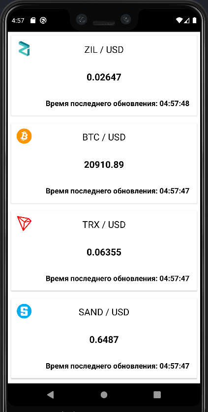
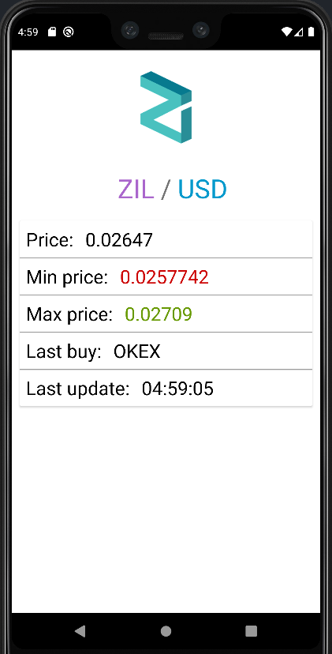

# CryptoApp

 

## Screenchots

## Highlights

- Use [crypto api](https://min-api.cryptocompare.com/) Api
- Use Material Design 2
- Support one language: English 
- Use locale Database

## Description

 Crypto app is an application that demonstrates my skills as an android developer. The following technologies and libraries were used in this project: dataBinding, Fragments, ViewModels, Dagger2, RoonDatabase, Retrofit 2, LiveData, Clean Architecture, Picasso.

## Technologies used
* Kotlin
* MVVM
* Retrofit 2
* Android Architecture Components
* Picasso
* Kotlin Coroutines
* Dagger 2
* RoomDatabase
* DataBinding